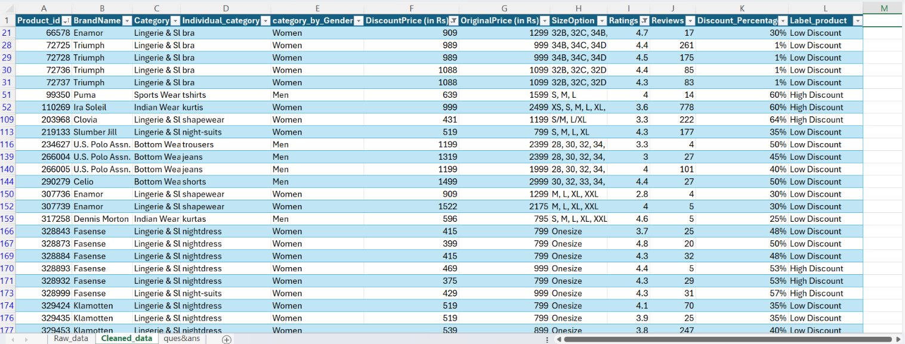
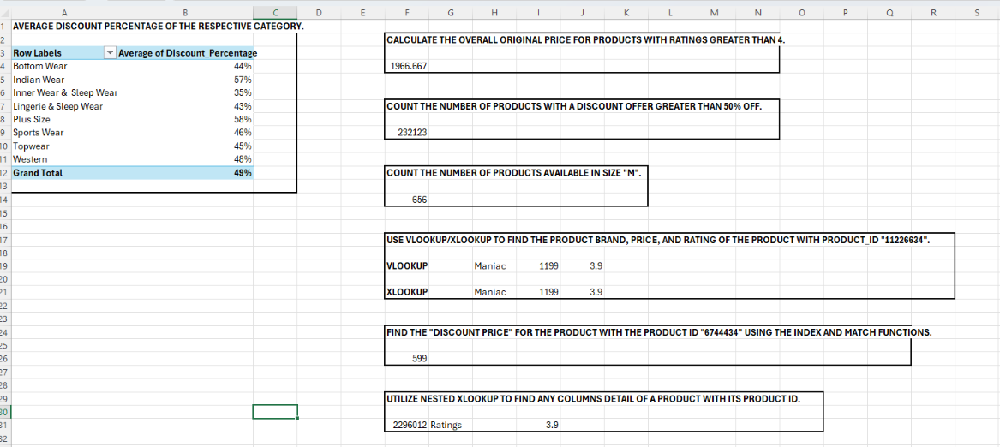

# Myntra Fashion Clothing Data Analysis

## Project Overview

This project focuses on cleaning, preparing, and analyzing a Myntra fashion clothing dataset using Microsoft Excel.

The project demonstrates practical skills in data cleaning, data analysis, product-level analysis, discount analysis, and Excel lookup functions.

---

## Objectives

- Clean and prepare the Myntra fashion clothing dataset.
- Identify and remove duplicate records.
- Handle missing values.
- Standardize discount-related information.
- Analyze product prices, ratings, discounts, and sizes.
- Classify products based on discount percentage.
- Retrieve product information using Excel lookup functions.

---

## Dataset

The dataset contains product-level information related to Myntra fashion products.

### Main Columns

- `Product_id`
- `BrandName`
- `Category`
- `Individual_category`
- `category_by_Gender`
- `DiscountPrice (in Rs)`
- `OriginalPrice (in Rs)`
- `DiscountOffer`
- `SizeOption`
- `Ratings`
- `Reviews`

---

## Data Cleaning

The following cleaning tasks were performed:

### Duplicate Records

Duplicate values were checked and removed.

### Discount Standardization

The `DiscountOffer` column was standardized into a consistent format.

### Missing Discount Price

Rows where both `DiscountPrice` and `DiscountOffer` were null were identified.

`DiscountPrice` was filled using the average discount price of the respective category.

### Missing Size Information

Null values in `SizeOption` were replaced with:

`Not Available`

---

## Data Analysis

The following analysis was performed:

### Average Original Price

Calculated the overall average original price for products with ratings greater than 4.

### Discount Analysis

Counted products having a discount greater than 50% OFF.

### Size Analysis

Counted products available in size `M`.

### Discount Classification

A new column named `Label_product` was created.

| Discount Condition | Label |
|---|---|
| Greater than 50% | High Discount |
| 50% or less | Low Discount |

---

## Product Lookup Analysis

Excel lookup functions were used to retrieve product information.

### Product ID: 11226634

The following information was retrieved:

- Brand
- Price
- Rating

### Product ID: 6744434

The `DiscountPrice` was retrieved using:

- INDEX
- MATCH

### Dynamic Product Lookup

Nested XLOOKUP was used to retrieve a selected column's information using Product ID.

---

## Excel Functions Used

- AVERAGEIF
- COUNTIF
- VLOOKUP
- XLOOKUP
- INDEX
- MATCH

---

## Project Structure

```text
Myntra-Fashion-Clothing-Analysis/
│
├── data/
│   └── README.md
│
├── questions/
│   ├── README.md
│   └── Project_Questions.md
│
├── analysis/
│   ├── README.md
│   └── Analysis_Answers.md
│
├── documentation/
│   └── EDA_Report.md
│
└── screenshots/
    ├── README.md
    ├── cleaned_data.png
    └── questions_answers.png

---

## Project Screenshots

### Cleaned Dataset



### Questions and Answers



### Analysis Results


### Lookup Analysis


---

## Key Skills Demonstrated

- Microsoft Excel
- Data Cleaning
- Data Preparation
- Exploratory Data Analysis
- Data Analysis
- Data Classification
- Missing Value Handling
- Duplicate Removal
- VLOOKUP
- XLOOKUP
- INDEX & MATCH
- Conditional Analysis
- Data Interpretation

---

## Project Outcome

This project demonstrates an end-to-end Excel-based data analysis workflow, starting from data cleaning and preparation and progressing to data analysis and product-level data retrieval.

It showcases practical use of Excel functions and analytical techniques on a large fashion retail dataset.

---

## Conclusion

The project provides practical experience in working with a large fashion retail dataset and demonstrates how Microsoft Excel can be used for data cleaning, analysis, classification, and lookup-based data retrieval.
